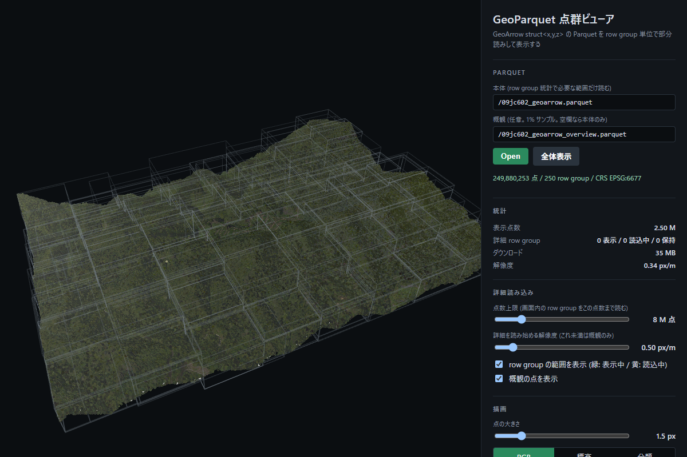
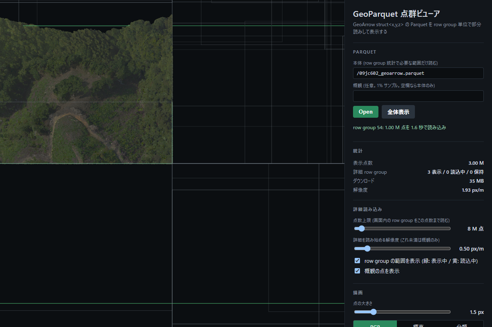
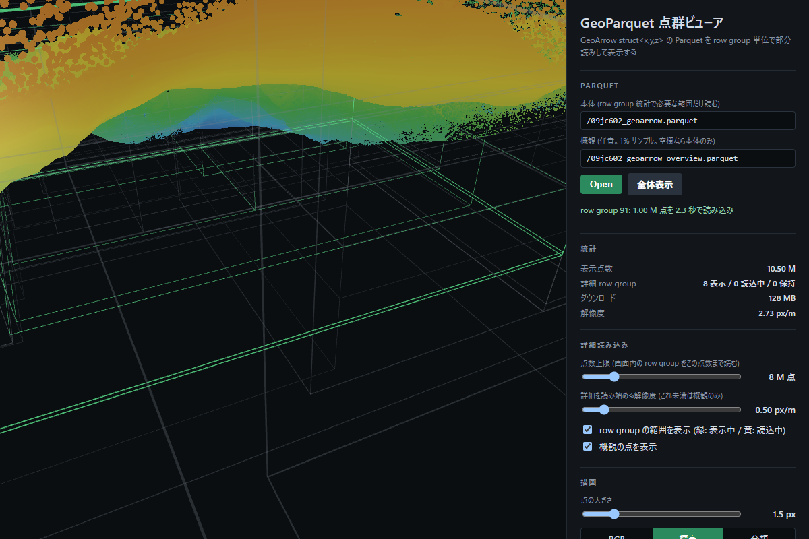

# 09jc602 LAS → LAZ / COPC / GeoParquet / PCP 変換

航空レーザ点群 1 ファイル (2.5 億点, LAS 8.5 GB) を LAS / LAZ / COPC / GeoParquet 3 種 / PCP で持ち、
サイズ・生成時間・クエリ速度・ブラウザ表示のしやすさを比較した作業記録。
GeoParquet を row group 単位で部分読みするブラウザビューア (`viewer/`) と、
LOD 付き Parquet (PCP) への変換スクリプトを含む。

読む順番の目安:

- 結論だけ知りたい → [1. 結論](#1-結論)
- 同じ変換を再現したい → [2. リポジトリ構成](#2-リポジトリ構成) → [4. 環境](#4-環境) → [5. 変換手順](#5-変換手順)
- `data/` にあるファイルがそれぞれ何か知りたい → [6. 出力ファイルの作成手法 (一覧)](#6-出力ファイルの作成手法-一覧)
- 数字の根拠 → [7. 計測結果の詳細](#7-計測結果の詳細)、[8. ALP 検証](#8-alp-を使えば-laz-に近づくか)
- ブラウザで見たい → [9. 調査](#9-点群-geoparquet-をブラウザで表示する-調査)、[10. 自作ビューア](#10-自作ビューア-viewer)、[11. PCP](#11-pcp-point-cloud-parquet-への変換と-r2-配置)
- つまずいたら → [付録 B. ハマりどころ索引](#付録-b-ハマりどころ索引)

## 1. 結論

249,880,253 点。実測環境は 64 GB RAM / 16 コア。ファイルはいずれも `data/` 以下。

| 形式 | ファイル | サイズ | B/点 | LAS 比 | 生成時間 | bbox クエリ |
|---|---|---|---|---|---|---|
| LAS (入力) | `09jc602/09jc602.las` | 8.50 GB | 34.0 | 1.00 | – | 86.3 s |
| GeoParquet (Snappy, xyz+wkb) | `09jc602.parquet` | 7.87 GB | 31.5 | 0.93 | 約 5 分 | **1.8 s** |
| GeoParquet (ZSTD, wkb のみ) | `09jc602_zstd.parquet` | 3.80 GB | 15.2 | 0.45 | +2 分 19 秒 | 5.8 s |
| GeoParquet (ZSTD, GeoArrow struct) | `09jc602_geoarrow.parquet` | **2.92 GB** | 11.7 | 0.34 | +9 分 06 秒 | **0.1 s** |
| COPC (untwine) | `09jc602_untwine.copc.laz` | 2.25 GB | 9.0 | 0.26 | **5 分 26 秒** | **0.5 s** |
| PCP (Parquet, Morton 順 + LOD) | `09jc602_pcp.parquet` | 2.32 GB | 9.3 | 0.27 | +14 分 38 秒 | 0.2 s |
| LAZ | `09jc602.laz` | 1.90 GB | 7.6 | **0.22** | 3 分 52 秒 | 84.6 s |

bbox クエリ = 100 m 四方 (`X: -77100〜-77000, Y: 11000〜11100`) の点数を数える。
全形式とも **449,428 点**で一致。
「+」の生成時間は `09jc602.parquet` (約 5 分) からの追加時間。PCP は GeoArrow 版 (+9 分 06 秒) から
さらに 5 分 32 秒。PCP の bbox クエリは量子化した INT32 列 (`x BETWEEN -7710000 AND -7700000 …`) に対するもので、
Morton 順のため row group の bbox が小さく、3,821 row group の統計で読み飛ばしが効く (2026-09-06 計測)。
COPC は untwine 1.5.1 で作った値。同じ COPC を PDAL `writers.copc` で作ると 69 分 37 秒かかる
(2.33 GB, bbox 0.8 s) が、これは単一スレッドで全点をメモリに載せるその実装固有の遅さで、形式のコストではない
(点数を変えた計測は [7 章](#copc-生成時間の切り分け-2026-09-05))。COPC を作るなら untwine を使う。

### 用途別の選択

| 用途 | 形式 |
|---|---|
| 保管・受け渡し | LAZ |
| Web 配信・ビューア (範囲/解像度指定の部分読み) | COPC (生成は untwine で)。Parquet で揃えたいなら PCP |
| SQL で属性集計・他データとの結合 (DuckDB spatial の `ST_*` を使う) | GeoParquet (ZSTD + wkb) |
| 座標を数値として頻繁に扱う、bbox 抽出、容量も抑えたい | GeoParquet (ZSTD + GeoArrow struct) |
| GDAL / QGIS から読む | どの GeoParquet でも可 |

LOD 付きで Web 配信したい場合は、COPC のほか、row group をレベル別に並べ直した Parquet (PCP、[11 章](#11-pcp-point-cloud-parquet-への変換と-r2-配置)) でもできる。
サイズ・bbox クエリは COPC と同等だが、GeoParquet ではない (GDAL / QGIS / DuckDB spatial では点群として読めない) うえ、
読めるビューアが kanahiro.github.io/pcp だけで、その要件も更新で変わる。
GeoParquet そのままでも row group 単位の部分読みは効く ([10 章](#10-自作ビューア-viewer)) が、LOD は無い。

### 所見

- **容量最小は LAZ** (1.90 GB, LAS の 22%)。ただし空間インデックスが無いので
  bbox 抽出は LAS と同じく全読み (84.6 s)
- **COPC は bbox 抽出が 0.5 秒**で LAZ の 170 倍速い。容量も 2.25 GB と LAZ の 1.2 倍に収まる。
  生成は untwine で 5 分半 (LAZ の 1.4 倍)。PDAL `writers.copc` は使わない (69 分)
- **GeoParquet は列単位の集計が圧倒的に速い** (0.3〜0.6 秒)。
  属性で絞る・統計を取る用途なら他形式が勝てない
- **GeoParquet の bbox 抽出も 1.8 秒**と速い。row group ごとの min/max 統計で
  読み飛ばしが効くため。ただし ZSTD + wkb 版は WKB のデコードが入るので 5.8 秒
- **GeoArrow struct 版は bbox 抽出 0.1 秒**で COPC より速い。x/y が独立した
  double 列なので row group 統計がそのまま座標に効き、デコードも要らない。
  サイズも 2.92 GB で GeoParquet 3 種の中で最小。
  代わりに DuckDB spatial 拡張 (v1.1.3) では読めない
- **PCP は COPC と同じサイズ・同じ bbox 速度を Parquet で実現する** (2.32 GB, 0.2 秒)。
  座標を INT32 に量子化して DELTA 符号化し、Morton 順に並べているため。ただし LOD 順に並べ替えた
  副作用で `gps_time` が圧縮されなくなり (0.99 GB)、既定で落としている
- ZSTD + wkb 化でサイズは 7.87 → 3.80 GB (52% 減)。
  DuckDB spatial は `geo` メタデータを読んで `wkb` 列を GEOMETRY 型として
  自動認識するので、`ST_X(wkb)` のようにキャスト無しで書ける

## 2. リポジトリ構成

```
.
├── README.md
├── scripts/                変換・検証スクリプト (リポジトリルートで実行する)
│   ├── setup_pdal.ps1        conda-forge PDAL を C:\mm\pdal に構築
│   ├── build.ps1             LAS → LAZ / COPC / GeoParquet を一括生成
│   ├── las2geoparquet.json   PDAL パイプライン
│   ├── make_repack_sql.py    geo メタデータを引き継ぐ再パック SQL を生成
│   ├── repack_zstd.sql       生成された DuckDB SQL (ZSTD + wkb のみ)
│   ├── build_geoarrow.ps1    GDAL で GeoArrow struct + ZSTD に再エンコード
│   ├── verify_geoarrow.sql   GeoArrow 版の検証クエリ
│   ├── build_pcp.py          GeoArrow 版 → PCP (kanahiro.github.io/pcp 用の LOD 付き Parquet)
│   ├── pcp_sort.sql          その DuckDB テンプレート (Morton ソートとレベル割り当て)
│   ├── build_pcp.ps1         PCP 変換と R2 アップロードの手順
│   └── r2_cors.json          R2 バケットの CORS 設定
├── experiments/alp/        「ALP で LAZ に近づくか」の検証 (results/ に実行ログ)
├── experiments/copc/       COPC 生成時間の切り分け (writers.copc の点数スケーリング vs untwine)
├── viewer/                 GeoParquet 点群ビューア (deck.gl + hyparquet)
│   ├── index.html / app.js / worker.js / points.js
│   ├── serve.py              Range 対応の静的サーバ
│   ├── make_overview.sql     概観用 1% サンプルを作る DuckDB SQL
│   └── dev/test_viewer.mjs   puppeteer での動作確認
├── docs/images/            スクリーンショット
└── data/                   点群と生成物 (git 管理外。合計 40 GB 弱)
    ├── 09jc602/09jc602.las   入力 (09jc602.zip を展開)
    ├── 09jc602.laz
    ├── 09jc602.copc.laz / 09jc602_untwine.copc.laz   COPC (PDAL writers.copc 版 / untwine 版)
    ├── 09jc602.parquet / 09jc602_zstd.parquet / 09jc602_geoarrow.parquet
    ├── 09jc602_geoarrow_overview.parquet   ビューアの概観用
    ├── 09jc602_pcp.parquet / 09jc602_pcp_test.parquet   PCP 形式 (全体 / 200 m 四方のテスト)。*.sql は生成に使った DuckDB SQL
    └── 09jc602_int32_*.parquet / 09jc602_double_bss.parquet   ALP 実験 (GeoParquet として無効)
```

スクリプトはすべてリポジトリルートをカレントにして実行する前提で、
入出力は `data/` 以下を相対パスで参照する。`data/` は `.gitignore` 済みなので、
別環境で再現するときは `data/09jc602/09jc602.las` を置いてから `scripts/build.ps1` を実行する。

### スクリプト一覧

| ファイル | 内容 |
|---|---|
| `scripts/setup_pdal.ps1` | conda-forge PDAL 2.10.2 と untwine 1.5.1 を `C:\mm\pdal` に構築 |
| `scripts/build.ps1` | LAZ / COPC / GeoParquet を一括生成 |
| `scripts/las2geoparquet.json` | PDAL パイプライン (LAS → GeoParquet) |
| `scripts/make_repack_sql.py` | `geo` メタデータを引き継ぐ再パック SQL を生成 |
| `scripts/repack_zstd.sql` | 生成された DuckDB SQL (ZSTD + wkb のみ) |
| `scripts/build_geoarrow.ps1` | GDAL (ogr2ogr) で GeoArrow + ZSTD に再エンコード |
| `scripts/verify_geoarrow.sql` | GeoArrow 版の検証クエリ (DuckDB) |
| `scripts/build_pcp.py` | GeoArrow 版 → PCP 形式 (Morton 順 + additive voxel LOD、`point_cloud` メタデータ) |
| `scripts/pcp_sort.sql` | 上記の DuckDB テンプレート (量子化・Morton ソート・レベル割り当て) |
| `scripts/build_pcp.ps1` | PCP 変換と R2 アップロードの手順 |
| `scripts/r2_cors.json` | R2 バケットの CORS 設定 (kanahiro.github.io からの Range 付き GET を許可) |
| `experiments/alp/alp_experiment.sql` | ALP 検証 A: 座標を int32 (×100) にして ZSTD (DuckDB) |
| `experiments/alp/alp_experiment_pyarrow.py` | ALP 検証 B/C/D: DELTA_BINARY_PACKED / BYTE_STREAM_SPLIT / 辞書の組み合わせ (pyarrow) |
| `experiments/alp/alp_estimate.py` | ALP の理論サイズ (1024 値ブロック FOR + bit-pack) を int32 座標から見積もる |
| `experiments/alp/alp_duckdb_native.ps1` | DuckDB のストレージに実装済みの本物の ALP で座標列サイズを実測 |
| `experiments/alp/results/*.log` | 上記の実行ログ |
| `experiments/copc/copc_bench.ps1` | COPC 生成時間の切り分け: `writers.copc` を 2,607 万 / 1 億 429 万点で計測、untwine で全体を生成 (メモリピークも記録) |
| `experiments/copc/results/copc_bench.log` | その実行ログ |
| `viewer/` | GeoParquet 点群ビューア (後述) |
| `docs/images/viewer_*.png` | ビューアの画面 |
| `docs/images/reference_parquet_field_viewer.png` | 参考にした他のビューアの画面 (第三者の UI のため git 管理外) |

## 3. 入力データ

`data/09jc602/09jc602.las` (8.50 GB, 09jc602.zip を展開したもの)

| 項目 | 値 |
|---|---|
| 点数 | 249,880,253 |
| 形式 | LAS 1.2 / Point Data Record Format 3 (GpsTime + RGB) |
| 圧縮 | なし |
| scale | 0.01 (X/Y/Z とも) |
| 範囲 | X: -78000〜-76000.01 / Y: 10500〜11999.99 / Z: 427.77〜877.93 |
| CRS | **ファイルに入っていない** |
| 属性 | X, Y, Z, Intensity, ReturnNumber, NumberOfReturns, ScanDirectionFlag, EdgeOfFlightLine, Classification, Synthetic, KeyPoint, Withheld, Overlap, ScanAngleRank, UserData, PointSourceId, GpsTime, Red, Green, Blue |

### CRS について

LAS に測地情報が無く、`.prj` 等のサイドカーも zip に入っていない。
ファイル名の先頭 `09` と座標値から **EPSG:6677 (JGD2011 / 平面直角座標系 IX 系)** と判断し、
`readers.las.override_srs` で付与している。**別系だった場合はここを直すこと。**

GeoParquet は CRS を必ずメタデータに書くため、指定しないと
`writers.arrow` は既定で **EPSG:4326 を書いてしまう**（今回のデータでは誤り）。

## 4. 環境

実測環境は Windows 11 / 64 GB RAM / 16 コア / RTX 4060。使ったツールと注意点。

### PDAL 2.10.2 (conda-forge) — arrow プラグインが必要

`writers.arrow` はプラグインなので、ビルドによって入っていない／動かない。

| ビルド | writers.arrow | feather | parquet |
|---|---|---|---|
| QGIS 3.34.12 同梱 pdal 2.8.1 | なし | – | – |
| OSGeo4W pdal 2.10.0-4 | あり | OK | **クラッシュ** |
| conda-forge pdal 2.10.2 (`C:\mm\pdal`) | あり | OK | **OK** |

OSGeo4W 版は `libpdal_plugin_writer_arrow.dll` を同梱し `--drivers` にも出るが、
parquet を書くと必ず落ちる (exit `0xC0000409` = STACK_BUFFER_OVERRUN、
出力は `PAR1` の 4 バイトのみ)。`batch_size` や `write_pipeline_metadata` を
変えても、`format` を `parquet` / `geoparquet` のどちらにしても再現する。
feather は正常に書けるので arrow 本体ではなく parquet 経路の問題。

そのため **変換には conda-forge 版 (`C:\mm\pdal`) を使う**。構築は `scripts/setup_pdal.ps1`。

この切り分けの過程で OSGeo4W 側を更新してしまい元に戻せない。経緯は [付録 A](#付録-a-osgeo4w-への副作用) に分離した。

### untwine 1.5.1 (conda-forge)

COPC 生成用。PDAL の `writers.copc` は単一スレッドで全点をメモリに載せるため、2.5 億点で 69 分・30 GB 近くを使う。
untwine はマルチスレッドで同じ入力を 5 分 26 秒・メモリ 0.8 GB で処理する ([7 章](#7-計測結果の詳細))。
`scripts/setup_pdal.ps1` で PDAL と同じ環境 (`C:\mm\pdal`) に入る。既存環境に足すなら
`C:\mm\micromamba.exe install -p C:\mm\pdal -c conda-forge untwine`。
`--temp_dir` に一時ファイルを約 20 GB (9,000 個以上) 作るので、短いパスの空きディスクを指定し、終わったら消す。

### GDAL 3.13.3 (OSGeo4W)

GeoArrow struct への再エンコード (`scripts/build_geoarrow.ps1`) に使う。

使った GDAL は OSGeo4W の 3.13.3 (arrow-cpp 25.0.1)。conda-forge の PDAL 環境
(`C:\mm\pdal`) にも GDAL 3.13.3 と `ogr_Parquet.dll` が入っているが、
`GDAL_DRIVER_PATH` を通さないと Parquet ドライバが見えない。

### DuckDB 1.1.3 (winget)

再パック・検証クエリ・PCP のソートに使う。

`duckdb -f file.sql` は動かない (`-f` は DB ファイル指定と解釈される)。
`duckdb -c ".read file.sql"` か `duckdb < file.sql` を使うこと。

DuckDB は他プロセスが開いているファイルを読めない
(`IO Error: File is already open in ... qgis-bin.exe`)。QGIS を閉じてから実行すること。

DuckDB 1.1.3 は Parquet の `PARQUET_VERSION V2` を書けない (DELTA_BINARY_PACKED 等が必要な実験は pyarrow で書いた。[8 章](#8-alp-を使えば-laz-に近づくか))。
`0x1F` 形式の 16 進リテラルも受け付けない ([11 章](#11-pcp-point-cloud-parquet-への変換と-r2-配置))。

### Python / Node

Python は DuckDB / pyarrow / numpy (PCP 変換、ALP 実験)。ビューアの動作確認は Node 22 + puppeteer-core + headless Chrome。

## 5. 変換手順

```powershell
# リポジトリルートで実行
.\scripts\setup_pdal.ps1      # 初回のみ
.\scripts\build.ps1
.\scripts\build_geoarrow.ps1  # OSGeo4W の GDAL 3.13 が必要。data/09jc602.parquet から作る
duckdb -c ".read viewer/make_overview.sql"   # ビューア用の概観サンプル (数秒)
python scripts/build_pcp.py data/09jc602_geoarrow.parquet data/09jc602_pcp.parquet   # PCP (11 章。約 7 分半)
```

個別に実行する場合:

```powershell
$PDAL = "C:\mm\pdal\Library\bin\pdal.exe"
$SRS  = "EPSG:6677"

# GeoParquet
& $PDAL pipeline scripts/las2geoparquet.json

# LAZ
& $PDAL translate data/09jc602/09jc602.las data/09jc602.laz --readers.las.override_srs=$SRS

# COPC (untwine。推奨。5 分 26 秒)
& "C:\mm\pdal\Library\bin\untwine.exe" -i data/09jc602/09jc602.las -o data/09jc602_untwine.copc.laz --temp_dir C:\mm\untwine_tmp --a_srs $SRS
Remove-Item -Recurse -Force C:\mm\untwine_tmp

# COPC (PDAL writers.copc。69 分 37 秒。比較用に残しているだけで、新規に作るなら untwine を使う)
& $PDAL translate data/09jc602/09jc602.las data/09jc602.copc.laz -w writers.copc --readers.las.override_srs=$SRS

# GeoParquet を ZSTD + wkb のみに再パック
python scripts/make_repack_sql.py data/09jc602.parquet data/09jc602_zstd.parquet scripts/repack_zstd.sql
duckdb -c ".read scripts/repack_zstd.sql"

# GeoParquet を GeoArrow (struct<x,y,z>) + ZSTD に再エンコード (OSGeo4W の GDAL)
C:\OSGeo4W\bin\o4w_env.bat
ogr2ogr -f Parquet data/09jc602_geoarrow.parquet data/09jc602.parquet -progress -nlt POINTZ `
  -select Intensity,ReturnNumber,NumberOfReturns,ScanDirectionFlag,EdgeOfFlightLine,Classification,Synthetic,KeyPoint,Withheld,Overlap,ScanAngleRank,UserData,PointSourceId,GpsTime,Red,Green,Blue `
  -lco GEOMETRY_ENCODING=GEOARROW -lco COMPRESSION=ZSTD -lco ROW_GROUP_SIZE=1000000 -lco WRITE_COVERING_BBOX=NO
```

### 5.1 PDAL `writers.arrow` (LAS → GeoParquet)

比較的新しく、まだ仕様が動いているステージ。

- **PDAL 2.6.0 (2023-09)** で追加。2.5.0 には存在しない
- 2025-02 に内部を大幅リライト ([#4611](https://github.com/PDAL/PDAL/pull/4611))
- **2026-08-27 に破壊的変更** ([#5109](https://github.com/PDAL/PDAL/pull/5109))
  — feather サポート削除、GeoParquet **2.0** 出力へ

そのためバージョン間でオプションが違う。

| | 2.9.0 | 2.10.x |
|---|---|---|
| GeoParquet 指定 | `format:"parquet"` + `geoparquet:"true"` | `format:"geoparquet"` |
| バージョン指定 | なし | `geoparquet_version` (既定 1.0.0) |
| feather | あり | あり (次で削除予定) |

`writers.arrow` に**圧縮方式のオプションは無く Snappy 固定**。
`xyz` / `wkb` の片方だけを書くオプションも無い。

#### 出力サイズが縮まない理由 (座標の二重持ち)

PDAL の GeoParquet 出力は **同じ座標を 2 列に重複して持つ**。

| 列 | 中身 | 生サイズ |
|---|---|---|
| `xyz` | GeoArrow 形式。double 3 個のリスト | 24 B |
| `wkb` | Well-Known Binary。5 B ヘッダ (Point Z) + double 3 個 | 29 B |

LAS は同じ座標を int32 スケール値 12 B で持っているので、
座標だけで 4 倍以上になる。さらに double はエントロピーが高く
Snappy がほとんど効かない (`xyz` 列の圧縮率は 92%、つまり 8% しか縮まない)。

7.87 GB の内訳 (圧縮後):

| 列 | サイズ | B/点 | 圧縮率 |
|---|---|---|---|
| wkb | 3.71 GB | 14.8 | 45% |
| xyz | 1.79 GB | 7.2 | 92% |
| GpsTime | 1.07 GB | 4.3 | 71% |
| Intensity | 0.41 GB | 1.6 | 100% |
| Red/Green/Blue | 0.67 GB | 2.7 | 100% |
| その他 13 列 | 0.22 GB | 0.9 | – |

対策として `xyz` を落として ZSTD をかける (= `repack_zstd.sql`)。
`wkb` 側を残すのは GeoParquet の `primary_column` がそれを指しており、
これを消すと QGIS / GDAL / DuckDB spatial から地物として読めなくなるため。

`xyz` を落とすと座標を数値で使うときに WKB を解く必要がある。

```sql
-- xyz あり
SELECT xyz[1], xyz[2], xyz[3] FROM 'data/09jc602.parquet';

-- wkb のみ (DuckDB spatial 拡張が必要)
SELECT ST_X(g), ST_Y(g), ST_Z(g) FROM (SELECT ST_GeomFromWKB(wkb) g FROM 'data/09jc602_zstd.parquet');
```

### 5.2 DuckDB で ZSTD + wkb のみに再パック

`xyz` を落として ZSTD をかける。`scripts/make_repack_sql.py` が `repack_zstd.sql` を生成する。

DuckDB の `COPY` は元ファイルの key-value メタデータを引き継がないので、
`geo` を `KV_METADATA` で明示的に付け直している (`scripts/make_repack_sql.py` がその処理)。

### 5.3 GDAL で GeoArrow struct + ZSTD に再エンコード

wkb を残す方式は 1 点あたり 5 B の WKB ヘッダと、座標を BLOB として持つ非効率が残る。
GDAL の Parquet ドライバは GeoParquet 1.1 の **GeoArrow ネイティブ点エンコード**
(`geometry` = `struct<x double, y double, z double>`) と **ZSTD** の両方を書けるので、
PDAL 出力の `09jc602.parquet` を `ogr2ogr` で再エンコードした (`scripts/build_geoarrow.ps1`)。

- 入力の `wkb` 列を geometry として読み、`xyz` 列は `-select` で捨てる
  (GeoArrow 列が 1 本になるので二重持ちが無くなる)
- GDAL は PDAL 出力の `geo` メタデータと CRS (EPSG:6677) をそのまま読める
- **`-nlt POINTZ` が必須**。PDAL の `geo` メタデータは geometry_types を 2D `Point` と
  書いており、指定しないと出力の struct が x, y だけになる
  (実行中に「Z component will be discarded」の警告が出るが、`-nlt POINTZ` を
  付けていれば出力に z は入る。値も検証済み)
- **`WRITE_COVERING_BBOX=NO`** を指定。既定 (AUTO) では `geometry_bbox`
  (xmin/ymin/xmax/ymax の float32 struct) が付き、点データではファイルの 4 割を占める
  冗長列になる。struct の x/y 列自体に row group 統計が付くので無くても読み飛ばしは効く
- `ROW_GROUP_SIZE=1000000` で ZSTD+wkb 版と同じ 250 row group に揃えた
- 9 分 06 秒で 2.92 GB。DuckDB の再パック (2 分 19 秒) より遅いが、
  1 ファイルの全件変換としては許容範囲

### 5.4 読めるツールの違い (重要)

| ツール | ZSTD + wkb | GeoArrow struct |
|---|---|---|
| GDAL / QGIS (ogrinfo で `3D Point`, EPSG:6677 を認識) | OK | OK |
| DuckDB 素の parquet 読み | `wkb` は BLOB | `geometry.x` で struct 直接参照。**最速** |
| DuckDB spatial 拡張 (v1.1.3) | GEOMETRY として自動認識 | **読めない** (`Geoparquet column 'geometry' has an unsupported encoding`) |

DuckDB spatial を `LOAD` した状態では、GeoArrow 版は `SELECT *` すらエラーになる。
spatial を読み込まなければ普通の struct 列として問題なく扱える。
DuckDB spatial で `ST_*` を使いたいなら ZSTD+wkb 版を使うこと。

## 6. 出力ファイルの作成手法 (一覧)

`data/` 以下の全出力を「何から・何で・どういうレイアウトで」作ったかで整理する。
特に PDAL で作った GeoParquet と PCP は両方 Parquet だが別物なので、違いを最後にまとめた。
列型・エンコード・row group 数は 2026-09-05 に各ファイルの footer を DuckDB の
`parquet_schema` / `parquet_metadata` / `parquet_kv_metadata` で読み直して確認した値。

### 派生関係

```
data/09jc602/09jc602.las  (LAS 1.2, 入力)
 ├─ PDAL translate (writers.las)  ────────► 09jc602.laz
 ├─ PDAL translate (writers.copc) ────────► 09jc602.copc.laz
 ├─ untwine ───────────────────────────────► 09jc602_untwine.copc.laz     同じ COPC。13 倍速い
 └─ PDAL pipeline  (writers.arrow) ───────► 09jc602.parquet                GeoParquet 1.0 / Snappy / xyz + wkb
      ├─ DuckDB COPY (repack_zstd.sql) ───► 09jc602_zstd.parquet           GeoParquet 1.0 / ZSTD / wkb のみ
      └─ GDAL ogr2ogr (build_geoarrow.ps1) ► 09jc602_geoarrow.parquet       GeoParquet 1.1 / ZSTD / GeoArrow struct
           ├─ DuckDB 1% サンプル (make_overview.sql) ► 09jc602_geoarrow_overview.parquet   自作ビューアの概観用
           ├─ DuckDB / pyarrow (experiments/alp/)    ► 09jc602_int32_*.parquet, 09jc602_double_bss.parquet   ALP 実験
           └─ DuckDB + pyarrow (build_pcp.py)        ► 09jc602_pcp.parquet, 09jc602_pcp_test.parquet          PCP
```

PDAL 出力の `09jc602.parquet` が Parquet 系の根で、それ以外の Parquet は全部そこからの再エンコード。
LAS を直接読むのは PDAL の 3 本と untwine だけ。

### ファイル別

| ファイル | 作成ツール / スクリプト | 入力 | 座標の持ち方 | 圧縮・エンコード | row group | 点の並び | メタデータ | 読めるもの | サイズ |
|---|---|---|---|---|---|---|---|---|---|
| `09jc602.laz` | PDAL 2.10.2 `translate` (writers.las、拡張子で LAZ) | LAS | int32 × scale 0.01 (LAS のまま)。**LAS 1.4 / PDRF 7 に上がる** (WKT で CRS を書くため。1.2 PDRF 3 のままではない) | LASzip (予測 + 算術符号) | – (chunk 5 万点) | スキャン順 | LAS 1.4 ヘッダ + WKT CRS (EPSG:6677) | LAS を読める全ツール | 1.90 GB |
| `09jc602.copc.laz` | PDAL `translate -w writers.copc` (単一スレッド。69 分) | LAS | 同上 (LAS 1.4 / PDRF 7) | LASzip + 八分木 (EPT 階層) | 八分木ノード単位 | 空間 (八分木) | LAS 1.4 + COPC VLR + WKT CRS | QGIS、Potree 等 COPC 対応ビューア、PDAL | 2.33 GB |
| `09jc602_untwine.copc.laz` | untwine 1.5.1 `--a_srs EPSG:6677` (マルチスレッド。5 分 26 秒) | LAS | 同上 | 同上 | 同上 | 同上 | 同上 | 同上 | 2.25 GB |
| `09jc602.parquet` | PDAL `pipeline scripts/las2geoparquet.json` (writers.arrow, `format=geoparquet`) | LAS | double。`xyz` (list<double>[3], GeoArrow 風) と `wkb` (BLOB) の **二重持ち** | Snappy 固定。RLE_DICTIONARY | 954 個 (`batch_size` 262,144) | スキャン順 | `geo` 1.0.0 (primary = wkb, CRS 6677), `ARROW:schema` | GDAL/QGIS、DuckDB (spatial 可)、pyarrow | 7.87 GB |
| `09jc602_zstd.parquet` | DuckDB 1.1.3 `COPY` (`make_repack_sql.py` → `repack_zstd.sql`) | `09jc602.parquet` | `wkb` のみ (BLOB、5 B ヘッダ + double×3) | ZSTD。PLAIN (DuckDB 1.1 は辞書を使わない) | 250 個 (約 100 万点) | スキャン順 | `geo` を `KV_METADATA` で引き継ぎ | GDAL/QGIS、DuckDB spatial。座標を数値で使うには WKB を解く | 3.80 GB |
| `09jc602_geoarrow.parquet` | GDAL 3.13.3 `ogr2ogr -lco GEOMETRY_ENCODING=GEOARROW` (`build_geoarrow.ps1`) | `09jc602.parquet` (wkb 列を geometry として読む) | `geometry` = struct<x,y,z double> の 1 列 | ZSTD。RLE_DICTIONARY (0.01 刻みなので実質整数格納) | 250 個 (100 万点) | スキャン順 | `geo` 1.1.0 (`encoding: point`, CRS 6677), `gdal:creation-options` | GDAL/QGIS、DuckDB 素の parquet 読み (spatial 拡張は不可)、自作ビューア | 2.92 GB |
| `09jc602_geoarrow_overview.parquet` | DuckDB `COPY ... USING SAMPLE 1%` (`viewer/make_overview.sql`) | `09jc602_geoarrow.parquet` | 同上 struct (色・分類・強度のみ残す) | ZSTD。PLAIN | 5 個 (50 万点) | ランダム (bernoulli 1%) | **無し**。DuckDB の COPY は `geo` を落とすので GeoParquet としては無効 | 自作ビューアのみ (struct を直接読む) | 35 MB |
| `09jc602_int32_v1.parquet` (ALP A) | DuckDB `COPY` (`experiments/alp/alp_experiment.sql`) | `09jc602_geoarrow.parquet` | `xi` `yi` `zi` INT32 (×100)。平坦列 | ZSTD。PLAIN | 250 個 | スキャン順 | 無し (サイズ比較専用) | 表形式としてのみ | 3.21 GB |
| `09jc602_int32_delta.parquet` (ALP B) | pyarrow (`alp_experiment_pyarrow.py`) | ALP A | 同上 INT32 | ZSTD。座標 DELTA_BINARY_PACKED、GpsTime BYTE_STREAM_SPLIT、他 PLAIN | 250 個 | スキャン順 | 無し | 同上 | 2.85 GB |
| `09jc602_double_bss.parquet` (ALP C) | pyarrow | `09jc602_geoarrow.parquet` (struct を平坦化) | `x` `y` `z` double 平坦列 | ZSTD。座標・GpsTime BYTE_STREAM_SPLIT | 250 個 | スキャン順 | 無し | 同上 | 4.60 GB |
| `09jc602_int32_delta_dict.parquet` (ALP D) | pyarrow | ALP A | INT32 | ZSTD。座標 DELTA_BINARY_PACKED、属性 RLE_DICTIONARY | 250 個 | スキャン順 | 無し | 同上 | 2.42 GB |
| `09jc602_pcp.parquet` | `scripts/build_pcp.py` (DuckDB `pcp_sort.sql` でソート → pyarrow で書き出し) | `09jc602_geoarrow.parquet` | `x` `y` `z` INT32 量子化 (×100、`scale`/`offset` で復元)。`red` `green` `blue` UINT16 (8 bit 値 × 257) | ZSTD。座標 DELTA_BINARY_PACKED、他 RLE_DICTIONARY。`gps_time` は既定で削除 | 3,821 個 (65,536 点、レベル境界をまたがない) | **Morton 順 + LOD レベル順** | `point_cloud` JSON (scale, offset, bounds, level_row_group_ends, voxel_edge_ratio, crs = PROJJSON)。`geo` は無し | kanahiro.github.io/pcp のみ (GeoParquet ではない) | 2.32 GB |
| `09jc602_pcp_test.parquet` | 同上 `--where` で 200 m 四方 | 同上 | 同上 | 同上 | 39 個 | 同上 | 同上 | 同上 | 19 MB |

`*.parquet.sql` (`data/09jc602_pcp.parquet.sql` など) は `build_pcp.py` が実行時に展開した DuckDB SQL の写し。

### PDAL/GDAL の GeoParquet と PCP の違い

| 観点 | GeoParquet (`09jc602*.parquet` の PDAL / DuckDB / GDAL 版) | PCP (`09jc602_pcp*.parquet`) |
|---|---|---|
| 規格 | OGC GeoParquet 1.0 / 1.1。`geo` メタデータで geometry 列・エンコード・CRS を宣言する | kanahiro.github.io/pcp の独自レイアウト。仕様書は非公開で、ビューアの worker とデモデータから要件を読み取った |
| 座標 | double の world 座標。WKB (BLOB) か GeoArrow struct<x,y,z> | INT32 の量子化値 + `scale` / `offset`。LAS と同じ考え方 |
| CRS | `geo` メタデータに EPSG:6677 | `point_cloud.crs` に PROJJSON で持つ (ビューアは検証するだけで座標はそのまま描く) |
| 点の並び | LAS のスキャン順のまま。row group は 100 万点ずつ機械的に切っただけ | 3D Morton (Z-order) 順。空間的に近い点が連続する |
| LOD | 無い。全点が 1 段階 | additive voxel LOD。L0 (40.96 m ボクセル) 〜 L11 (2 cm) + 余り (1 cm) の 13 段。各点はちょうど 1 レベルに属し、粗いレベルから累積して描く |
| row group | 250 個 × 100 万点。1 つの bbox がタイル境目で 2 km に広がることがある | 3,821 個 × 65,536 点。レベルごとに区切り、Morton 順なので bbox が小さくまとまる |
| 読み飛ばし | row group 統計 (x/y/z の min/max) で bbox 枝刈り | 同じ統計に加え `level_row_group_ends` で「どのレベルまで読むか」を画面上の誤差 (SSE) で決める |
| 属性 | LAS の全ディメンションを保持 | 列としては残すが PCP は x, y, z, red, green, blue しか読まない。`gps_time` は Morton 順で圧縮が効かないので既定で落とす |
| 読めるツール | GDAL / QGIS / DuckDB / pyarrow / 自作ビューア | PCP ビューアだけ。DuckDB や pyarrow では「x, y, z 列を持つ普通の表」として読める |
| 目的 | 解析・相互運用・長期保存 | ブラウザでの range request によるストリーミング表示 |
| 作り方 | PDAL または GDAL の既製ライタ。DuckDB は再圧縮のみ | 自作 (`build_pcp.py`)。DuckDB で量子化・Morton ソート・レベル割り当て、pyarrow で row group とメタデータを書く |

一言で言うと、GeoParquet は「LAS の中身を列指向にしたもの」で並び順は LAS のまま、
PCP は「ビューアが粗い方から順に読めるように点を並べ替え、その順序を row group とメタデータに焼き込んだもの」。
サイズが近い (2.92 GB と 2.32 GB) のは、どちらも座標が実質整数格納 (辞書 or DELTA) で ZSTD が掛かっているため。

## 7. 計測結果の詳細

[1 章](#1-結論) の表の根拠。クエリはすべて DuckDB 1.1.3。

### 検証クエリ

```sql
-- 点数と範囲
SELECT count(*), min(xyz[1]), max(xyz[1]), min(xyz[3]), max(xyz[3]) FROM 'data/09jc602.parquet';

-- GeoParquet メタデータ
SELECT decode(value) FROM parquet_kv_metadata('data/09jc602.parquet') WHERE CAST(key AS VARCHAR)='geo';

-- 列ごとの圧縮後サイズ
SELECT path_in_schema,
       round(sum(total_compressed_size)/1e9, 3) AS comp_GB,
       round(100.0*sum(total_compressed_size)/sum(total_uncompressed_size), 0) AS pct
FROM parquet_metadata('data/09jc602.parquet') GROUP BY 1 ORDER BY 2 DESC;
```

```powershell
# LAS/LAZ/COPC 側
& $PDAL info --summary data/09jc602.copc.laz
```

```sql
-- bbox クエリ (100 m 四方)。PCP は INT32 量子化座標なので 100 倍した整数で書く
SELECT count(*) FROM 'data/09jc602_geoarrow.parquet'
WHERE geometry.x BETWEEN -77100 AND -77000 AND geometry.y BETWEEN 11000 AND 11100;   -- 0.09 s
SELECT count(*) FROM 'data/09jc602_pcp.parquet'
WHERE x BETWEEN -7710000 AND -7700000 AND y BETWEEN 1100000 AND 1110000;              -- 0.18 s
```

### 列単位の集計 (Classification 別点数)

| ファイル | 時間 |
|---|---|
| `09jc602.parquet` | 0.6 s |
| `09jc602_zstd.parquet` | 0.3 s |
| `09jc602_geoarrow.parquet` | 0.4 s |

1 列しか読まないので、点数に対して桁違いに速い。Parquet の列指向が効く場面。

### Z 値の統計 (min/max)

| ファイル | 時間 | 備考 |
|---|---|---|
| `09jc602.parquet` | 1.7 s | `xyz[3]` を直接読む |
| `09jc602_zstd.parquet` | 5.8 s | `ST_Z(wkb)` で WKB を解く |
| `09jc602_geoarrow.parquet` | 1.3 s | `geometry.z` を直接読む |

`xyz` を落とした代償がここに出る。3.4 倍遅い。GeoArrow struct 版は列が分かれているので
z だけを読めば済み、最速。

### 座標列のサイズ比較 (圧縮後)

| 形式 | 座標の持ち方 | サイズ |
|---|---|---|
| Snappy, xyz+wkb | list<double> 24 B + WKB 29 B | 5.50 GB |
| ZSTD, wkb | WKB 29 B | 2.21 GB |
| ZSTD, GeoArrow struct | double ×3 (別列) | 1.40 GB (x 0.48 / y 0.48 / z 0.45) |

double 列自体は ZSTD でも 5〜8% しか縮まないが、WKB のヘッダ 5 B/点と
BLOB としての取り回しが無くなる分で 0.8 GB 減った。

### COPC 生成時間の切り分け (2026-09-05)

1 章の「COPC 生成 69 分 37 秒」が形式の性質か PDAL `writers.copc` の性質かを、点数を変えた計測と untwine との比較で確かめた
(`experiments/copc/copc_bench.ps1`、ログは `results/copc_bench.log`)。

| ツール | 点数 | 時間 | メモリピーク (WorkingSet) | 出力 |
|---|---|---|---|---|
| PDAL 2.10.2 `writers.copc` | 26,073,803 (先頭 1/10) | 1 分 31 秒 | 3.1 GB | 0.24 GB |
| PDAL 2.10.2 `writers.copc` | 104,295,212 (先頭 4/10) | 10 分 31 秒 | 11.8 GB | 0.97 GB |
| PDAL 2.10.2 `writers.copc` | 249,880,253 (全体、2026-09-01 の値) | 69 分 37 秒 | 未計測 (比例なら 28 GB) | 2.33 GB |
| untwine 1.5.1 | 249,880,253 (全体) | **5 分 26 秒** | **0.8 GB** | 2.25 GB |

- `writers.copc` は点数 4 倍で時間 6.9 倍と**超線形**に遅くなる。メモリも点数に比例して増え、全体では 30 GB 近くになる。
  2.5 億点で 69 分は異常値ではなく、この実装の延長線上にある。CPU は 16 コアのうち 1 つしか使わない
- 全体の実行では出力ファイルが開始 50 分後に初めて作られた (作成 23:27、完了 23:45)。
  全点を読み終えて八分木を組んでから書き出す構造で、前半が読み込みと構築、後半 18 分が LAZ 圧縮
- untwine は一時ファイル (約 20 GB、9,000 個超) に点を振り分けながらマルチスレッドで処理するのでメモリは 0.8 GB で済む。
  PDAL 公式も大きな入力には untwine を勧めている
- untwine 版の検証: 249,880,253 点、LAS 1.4 / PDRF 7、`copc: true`、CRS = JGD2011 / Japan Plane Rectangular CS IX、
  範囲は入力と一致。100 m 四方の bbox 抽出 (`readers.copc.bounds`) は 449,428 点で他形式と一致し、0.5 秒 (writers.copc 版は 0.8 秒)
- 両方の COPC を残しているのは比較のため。新規に作るなら untwine (`scripts/build.ps1` はそちらに変更した)

### 列の保持 (LAS の全ディメンションが残っているか)

PDAL が LAS 1.2 / PDRF 3 から読む 20 ディメンションはどの GeoParquet にも全て入っている。
X/Y/Z は geometry 列 (`xyz`+`wkb` / `wkb` / `geometry` struct) に畳まれ、残り 17 属性は列として残る。

| 列 | LAS (PDAL) | PDAL 出力 / ZSTD 版 | GeoArrow 版 (GDAL 経由) |
|---|---|---|---|
| Intensity, PointSourceId, Red/Green/Blue | uint16 | USMALLINT | INTEGER (int32 に拡張) |
| ReturnNumber 〜 Overlap, UserData | uint8 | UTINYINT | INTEGER (int32 に拡張) |
| ScanAngleRank | float32 | FLOAT | FLOAT |
| GpsTime | float64 | DOUBLE | DOUBLE |

GDAL (OGR) は符号なし小整数型を持たないため、GeoArrow 版では uint8/uint16 が int32 になる。
値は変わらず、Parquet の物理型はどちらも INT32 なのでサイズも変わらないが、
読み出し側での型 (Arrow スキーマ) は元の LAS と一致しない。
`Overlap` は LAS 1.4 用のフラグで、PDRF 3 には無い。PDAL が常に 0 で付けている。
LAS ヘッダ / VLR の情報 (scale/offset、生成ソフト名、点フォーマット番号など) は
列ではないので GeoParquet には残らない。CRS だけ `geo` メタデータに入る。

### 検証済み事項

`09jc602_zstd.parquet`:

- 249,880,253 行 (入力と一致)
- 18 列、ZSTD、250 row group
- GeoParquet 1.0.0 / `primary_column: wkb` / encoding WKB
- CRS: JGD2011 / Japan Plane Rectangular CS IX (EPSG:6677)

`09jc602_geoarrow.parquet` (`scripts/verify_geoarrow.sql`):

- 249,880,253 行、X -78000〜-76000.01、Z 427.77〜877.93 (入力と一致)
- 18 列、ZSTD、250 row group、`geometry_bbox` 無し
- GeoParquet 1.1.0 / `primary_column: geometry` / encoding `point`
- ogrinfo で `3D Point`、EPSG:6677 として認識
- Classification 別点数: 2 = 11,340,200 / 5 = 215,442,629 / 6 = 23,097,424

## 8. ALP を使えば LAZ に近づくか

(2026-09-03 検証)

「Parquet に ALP エンコードが入ったので LAZ と近いところまでいくのでは」という意見に対して、
このデータで確認した。

### ALP とは

ALP (Adaptive Lossless floating-Point) は SIGMOD 2024 の論文
(Afroozeh, Kuffo, Boncz) 由来の浮動小数点向け可逆エンコード。
double の多くは元々 `427.77` のような桁数の決まった十進小数なので、
`round(x × 10^e) / 10^f` が整数になる e, f をブロック (1024 値) ごとに探し、
整数化した値を **FOR (最小値からの差分) + ビットパッキング** で詰める。
整数化できない値は例外として別置きする。十進化できないデータには ALPRD
(前方ビットを辞書化する別方式) に切り替わる。
DuckDB は v0.10 (2024-02) から自身のストレージで使っており、
Parquet 仕様には 2026 年に取り込まれた。2026-08 時点で Preview
(仕様は確定、parquet-java 等の実装は進行中)。

点群の座標は LAS 側が「int32 × scale 0.01」で持っているので、
ALP はそれを double から自動で復元するのと同じことをする。
つまり **ALP ≒ LAS の整数格納に戻すこと** であり、その効果は
座標を int32 に戻して Parquet に書けば今日でも測れる。

### 実測

`09jc602_geoarrow.parquet` (2.92 GB) を起点に、座標の持ち方だけ変えて全 18 列を書き直した。
いずれも `geo` メタデータ無しでサイズ比較専用 (有効な GeoParquet ではない)。

| 版 | 座標の格納 | 属性列 | 座標 3 列 | 座標 B/点 | 全体 |
|---|---|---|---|---|---|
| GeoArrow (現行, GDAL) | double, 辞書 + ZSTD | 辞書 + ZSTD | 1.40 GB | 5.6 | 2.92 GB |
| A | int32, PLAIN + ZSTD (DuckDB 1.1.3) | PLAIN + ZSTD | 1.46 GB | 5.9 | 3.21 GB |
| B | int32, **DELTA_BINARY_PACKED** + ZSTD (pyarrow) | PLAIN + ZSTD | **1.06 GB** | **4.2** | 2.85 GB |
| C | double, BYTE_STREAM_SPLIT + ZSTD (pyarrow) | PLAIN + ZSTD | 2.81 GB | 11.2 | 4.60 GB |
| D | int32, DELTA_BINARY_PACKED + ZSTD | 辞書 + ZSTD | **1.06 GB** | **4.2** | **2.42 GB** |
| 参考: DuckDB 本物の ALP | DuckDB DB ファイル (列ごと) | – | 1.58 GB | 6.3 | – |
| 参考: ALP 理論値 | 1024 値ブロック FOR + bit-pack を計算 | – | 1.29 GB | 5.2 | – |
| 参考: LAZ | 予測 + 算術符号 | 同 | (分離不可) | – | **1.90 GB** |

各版の生成は 1〜2 分 (DuckDB / pyarrow とも)。

### 分かったこと

- **現行の GeoArrow 版は既に実質「整数格納」になっている。**
  GDAL の出力は x/y/z が `RLE_DICTIONARY` で、0.01 刻みの X は取りうる値が 20 万種類しか
  ないため、double 8 B ではなく約 17 bit の辞書インデックスとして格納されている
  (非圧縮 0.52 GB = 2.1 B/点)。これが GeoArrow 版が予想外に小さかった理由。
- **本物の ALP (DuckDB) は 6.3 B/点で、辞書 + ZSTD (5.6 B/点) に勝てなかった。**
  ALP は 1024 値ブロックの min〜max を bit-pack するが、スキャン順の連続 1024 点は
  80 m 程度の幅があり 13 bit 前後必要になる。理論値でも 5.2 B/点で、
  「ALP ≒ 整数格納」の利得はこのデータでは 1 割弱。
- **効くのは ALP ではなく DELTA_BINARY_PACKED** (Parquet に昔からある整数エンコード)。
  32 値のミニブロックで前値との差分を bit-pack するので、スキャン順の局所性が
  ALP の 1024 ブロック FOR より細かく効く。座標 3 列で 1.40 → 1.06 GB (24% 減)。
  ただし double 列には使えないので、**座標を int32 スケール値として持つ必要がある**。
  GeoArrow struct は double 前提のため、これをやると GeoParquet の geometry 列ではなくなる。
- **BYTE_STREAM_SPLIT は逆効果** (double をバイト面ごとに分ける方式。11.2 B/点)。
  辞書化が効くデータではバイト面分割の方が悪い。
- **最良 (D) で 2.42 GB、LAZ の 1.27 倍。** 意見にあった「ALP あり ≒ 整数格納で
  LAZ 比 2〜3 割の差」はこのデータでほぼそのとおり。ただし到達手段は ALP ではなく
  int32 + DELTA_BINARY_PACKED で、GeoParquet 互換を捨てる代償がある。
- 残りの差 (0.5 GB) は LAZ が座標を前点からの予測残差として算術符号化する部分。
  Parquet のエンコードはブロック単位の bit-pack が上限で、値ごとの適応的な
  エントロピー符号化は枠組みに無い。ここは意見どおり Parquet 側から届かない。
- 属性列 (Intensity, RGB, GpsTime で 1.2 GB) は座標と同程度の比重がある。
  LAZ はこれらも前点との差分 + 算術符号化で詰めるので、座標だけ頑張っても
  LAZ には並ばない。

結論: **サイズで LAZ を選ぶか、Arrow エコシステム (DuckDB 直読、列指向の集計、
row group 統計での読み飛ばし) で Parquet を選ぶか** という判断は ALP が来ても変わらない。
ALP が Parquet で実装されれば、GeoArrow struct の double 列をそのまま (int32 化せず)
辞書 + ZSTD と同程度〜やや良い程度に詰められる、という位置づけになる見込み。

参考:
[parquet-format Encodings.md](https://github.com/apache/parquet-format/blob/master/Encodings.md),
[GH-533 ALP 仕様マージ](http://www.mail-archive.com/commits@parquet.apache.org/msg04744.html),
[FSST and ALP (解説記事)](https://datalakehousehub.com/blog/fsst-alp-parquet-encodings/),
[ALP 論文 (arXiv)](https://arxiv.org/pdf/2308.11915)

実験で作ったファイル (`data/` 以下。GeoParquet として無効。不要なら削除してよい):
`09jc602_int32_v1.parquet` (A), `09jc602_int32_delta.parquet` (B),
`09jc602_double_bss.parquet` (C), `09jc602_int32_delta_dict.parquet` (D)。

## 9. 点群 GeoParquet をブラウザで表示する (調査)

(2026-09-03 時点)

### 表示できるビューア

「点群向け」を名乗る GeoParquet ビューアは、上のスクリーンショットのような個別実装を除くと
まだ無い。ベクタ点として描くものなら以下が使える。

| ツール | 読める形式 | 3D (Z) | LOD / 部分読み | 備考 |
|---|---|---|---|---|
| QGIS (GDAL 経由、ベクタレイヤ) | wkb 版・GeoArrow 版とも | 3D ビュー可 | なし。全読み | 2.5 億点は実用外。点群レイヤ (LAS/LAZ/COPC/EPT) としては読めない |
| lonboard (Python / Jupyter) | GeoArrow → `PointCloudLayer` | あり | なし。全点をブラウザに送る | 数百万点規模。`from_duckdb()` で DuckDB の結果を直接渡せる。EPSG:4326 に自動再投影 |
| deck.gl + `@geoarrow/deck.gl-geoarrow` | `@geoarrow/geoparquet-wasm` で読む | ScatterplotLayer は 2D。PointCloudLayer は deck.gl 本体側 | なし (row group ごとに逐次描画は可) | 自前 Web アプリ向け |
| DuckDB-WASM + 任意の描画 | HTTP range で row group 単位 | 描画側次第 | **row group 統計での読み飛ばしが効く** | スクリーンショットのビューアはこの系 |
| Potree / COPC viewer / GeoLibre 等の点群ビューア | LAS / LAZ / COPC / EPT | あり | オクツリー LOD | **Parquet 非対応** |

GeoParquet 側の議論 (opengeospatial/geoparquet Discussion #197) でも、
点群は「格納はできるが空間インデックスが無く COPC の 3 倍程度になる」という認識で、
標準としての点群対応は無い。LOD 付きで配信したいなら、現状は
(a) COPC に変換して既存ビューアを使う、(b) row group をレベル別に並べ直し
DuckDB-WASM / parquet-wasm で自前実装する、の二択。

### Parquet で LOD 配信するビューアの例

`docs/images/reference_parquet_field_viewer.png` (第三者の UI なので git 管理外) は、Parquet を直接ブラウザで読んで
COPC 的な LOD 描画をしているビューア (PCP / Spatial Lab「Parquet field viewer」) の画面。
東京タワー周辺 1,977,167 点の `114112.parquet` をローカル HTTP (`127.0.0.1:8080`) から開いている。

画面から読み取れる仕組み:

- **row group を LOD レベル別に並べる** (L0 3 / L1 12 / L2 32 / L3 49 / L4 17 の計 113 row group)。
  COPC のオクツリーノードを row group に置き換えた additive LOD。上位レベルの点を
  下位が置き換えるのではなく、足していく方式
- **row group ごとに空間 bbox と geometric error を持つ**。ビューアは footer の統計だけ読んで
  SSE (screen space error) 閾値 (画面では 4 px) と視野で row group を選び、
  必要な row group だけ HTTP range request で取る。画面では L0〜L2 の 32 row group を描画中
- 色は RGB / Elevation / LOD の切り替え。LAS 由来の属性列がそのまま使える

このプロジェクトでの意味:

- 「Web 配信・ビューアは COPC」という選択は Parquet を排除しない。
  **row group の並べ方 (レベル別 + 空間的にまとめる) と、row group 単位の統計** が
  あれば Parquet でも同じことができる。DuckDB で測った bbox クエリが速いのも同じ理屈
- ただし PDAL / GDAL の出力はスキャン順のまま 1M 点ずつ切っただけなので、
  このビューアの前提 (レベル別 row group + geometric error) は満たさない。
  やるなら COPC 同様にオクツリー (または点間隔ベースの間引き) を構築して並べ直す工程が要る。
  COPC 生成 (untwine で 5 分半、PDAL writers.copc だと 69 分) と同種のコストが Parquet 側にも乗る
- geometric error をどこに書くか (row group の key-value か、別 sidecar か) は
  GeoParquet 標準にはまだ無く、ビューア独自の取り決めになる

`09jc602` でこの方式を試すなら、DuckDB で `floor(x/size), floor(y/size)` のセル ID と
レベルを付けて `ORDER BY level, cell` で書き直すのが最短。未着手。

## 10. 自作ビューア (viewer/)

`09jc602_geoarrow.parquet` (2.5 億点、2.92 GB) をブラウザでそのまま表示するために作った。
前節の「読めるビューアが無い」への回答で、ファイルを変換し直さずに表示する。







### 使い方

```powershell
duckdb -c ".read viewer/make_overview.sql"   # 初回のみ。概観用 1% サンプル (250 万点, 35 MB) を data/ に作る
python viewer/serve.py                       # http://127.0.0.1:8080/viewer/ を開く
```

`python -m http.server` は Range リクエストを無視して全体を返すため使えない。
`viewer/serve.py` は Range / HEAD / CORS 対応の静的サーバで、リポジトリルートを配信する。
ページを開くと `data/09jc602_geoarrow.parquet` と概観を自動で読む (`?noauto` で止められる)。

### 仕組み

- **読み取り**: [hyparquet](https://github.com/hyparam/hyparquet) (純 JS の Parquet リーダ) を
  Web Worker で動かし、HTTP range request で footer と必要な row group だけを取る。
  ZSTD は hyparquet-compressors で解く。GeoArrow の `geometry` struct は `{x,y,z}` の
  オブジェクト配列で返るので、`points.js` で Float32Array (中心座標からの相対値) に変換する
- **空間インデックス**: footer にある row group ごとの `geometry.x/y/z` の min/max を bbox として使う。
  250 個の bbox を画面に投影し、画面に入っていて画面中心に近いものから
  点数上限 (既定 800 万点) まで読む。視点が動いて外れた row group は LRU で保持する
- **概観**: 全体を見るときに 250 row group 全部を読むわけにいかないので、DuckDB で作った
  1% サンプル (`09jc602_geoarrow_overview.parquet`) を常に表示し、拡大したところに詳細を重ねる
- **描画**: deck.gl 9.3 の `PointCloudLayer` に座標・色をバイナリ属性で渡す。`OrbitView` (Z 軸回転)。
  色は RGB / 標高 / ASPRS 分類の 3 モード。row group の範囲は `LineLayer` で描く
  (緑 = 表示中、黄 = 読込中)

### 実測 (RTX 4060, ローカル HTTP)

| 操作 | 時間 |
|---|---|
| footer 読み込み (250 row group の統計) | 0.1 秒 |
| 概観 250 万点の表示 | 2.2 秒 |
| 拡大時に詳細 8 row group (800 万点、128 MB) を読み込み | 5.0 秒 |
| 1 row group (100 万点、12 MB) の読み込み + 変換 (Worker 1 本あたり) | 1.3〜2.3 秒 |

### 分かったこと・制約

- **同時読み込みは 4 本まで**。ブラウザは同一ホストへ 6 接続しか張らず、hyparquet は
  1 row group につき列ごとに数本の range request を並列に出す。Worker 6 本で読むと
  接続を取り合ってページ全体が固まる (headless Chrome で再現)。4 本なら問題ない
- **Worker は 1 回の読み込みごとに使い捨てる** (2026-09-04 修正)。実機で Chrome が「Out of Memory」で
  落ちる問題の原因。hyparquet は GeoArrow の struct を点ごとの `{x,y,z}` オブジェクト (boxed double) に
  展開するので 1 row group で数百 MB のゴミが出るが、Worker 内の V8 はすぐ回収しない。
  概観 5 row group を読んだ直後で Worker 1 本のヒープが 0.7〜1.3 GB (強制 GC すると 4 MB) になり、
  4 本分でレンダラーが 2.2 GB を超え、詳細を読むと落ちるかメインスレッドが固まった。
  Worker を毎回 `terminate()` すると isolate ごと消えて確実に返る。修正後は詳細 8 row group を読みながら
  6 地点を移動しても headless Chrome の全プロセス合計ピークが 578 MB。代償は Worker 起動と footer の
  再読み込みで、1 回の移動あたり 1 秒ほど
- **bbox ベースの選択は無駄が出る**。row group は LAS のスキャン順を 100 万点ずつ切っただけなので、
  250 m タイルの境目にかかる row group は bbox が 2 km に広がる (例: row group 121 は両端の
  タイルにしか点が無いのに bbox は全幅)。画面に見えなくても読んでしまう。空間的に並べ直せば解決する
- **LOD は無い**。概観サンプル (1%) と詳細 (100%) の 2 段階だけ。中間の解像度が欲しければ
  前節のように row group をレベル別に並べたファイルを作る必要がある
- GeoParquet 1.1 の GeoArrow 点エンコード (`struct<x,y,z>`) 前提。wkb 版は読めない
  (座標の min/max 統計が BLOB には無いため)
- CDN (jsdelivr) から deck.gl と hyparquet を読むので、オフラインでは動かない

動作確認は puppeteer + headless Chrome で行った (`viewer/dev/test_viewer.mjs`)。
headless では `--use-angle=d3d11` を付けないとソフトウェア GL になり、数百万点の描画で
1 フレームに数十秒かかる。

## 11. PCP (Point Cloud Parquet) への変換と R2 配置

[kanahiro.github.io/pcp](https://kanahiro.github.io/pcp/) は Parquet の点群を row group 単位の
LOD でストリーミング表示するデモ。GeoParquet ではなく独自レイアウトを要求するので、
`09jc602_geoarrow.parquet` から `09jc602_pcp.parquet` を作った (`scripts/build_pcp.py`)。

仕様書は公開されていない (リポジトリ非公開) ため、ページの worker
(`point-cloud.worker-*.js`) とデモデータ (`cogp-demo.spatialty.io/temp/114112.parquet`,
parquet-rs 製) から読み取った要件で作っている。**要件はビューアの更新で変わる**。
9/4 に作ったファイルは 9/5 には `Invalid point_cloud metadata` で開けなくなっていた
(`voxel_edge_ratio` が必須になり、`crs` が文字列不可になった。下記)。

### PCP が要求するレイアウト

| 項目 | 内容 |
|---|---|
| 座標列 | `x` `y` `z` INT32 (量子化)。world = q × scale + offset。row group ごとの min/max 統計が必須 (bbox 枝刈りに使う) |
| 色列 | `red` `green` `blue` UINT16 (0〜65535)。(0,0,0) は色なし扱いで標高色になる。列が無いとエラー |
| row group | LOD レベル順 (粗 → 細) に並び、レベル境界をまたがない。列 x〜blue は連続して置く (1 回の range request でまとめて取る) |
| メタデータ | footer の key_value_metadata `point_cloud` (JSON)。worker が検証する項目: `version` == "0.1.0", `scale[3]` (全て > 0), `offset[3]`, `bounds[6]`, `level_row_group_ends[]` (レベルごとの row group 終端の累積、0 以上の整数), `voxel_edge_ratio` (整数 ≥ 2), `crs` (null か PROJJSON オブジェクト)。1 つでも外れると `Invalid point_cloud metadata`。知らないキーは無視 |
| LOD | 全 L レベルのうちレベル t の幾何誤差 = \|scale\| × `voxel_edge_ratio`^(L−1−t)。最終レベルは誤差 0。つまり最細レベルのボクセル 1 辺 = scale、レベル 0 = scale × ratio^(L−1) と解釈される。ファイル側の段数をこれに合わせないと SSE の見積りがずれる |
| 圧縮 | ZSTD。座標は DELTA_BINARY_PACKED、gps_time は BYTE_STREAM_SPLIT、他は辞書 (デモに合わせた。読むのは hyparquet) |
| CRS | `crs` に PROJJSON (pyproj `CRS.from_epsg(6677).to_json_dict()`) を入れる。座標変換には使われず、そのまま描く |

9/4 時点の worker は `voxel_edge_ratio` を見ず `crs` も検証しなかったので、`base_voxel_size` /
`coarsest_voxel_size` / `hierarchy` / `spatial_order` と `crs: "EPSG:6677"` を書いていた。
現行 worker では `voxel_edge_ratio` 欠落と文字列 `crs` の両方で落ちる。
`build_pcp.py` の `check_point_cloud_meta()` に worker の検証関数を写してあるので、書き出す前に同じ条件で確かめられる。

その他の属性列 (intensity, classification, gps_time など) はデモの列名 (snake_case) に合わせて残しているが、
PCP は読まない。

### LOD の作り方 (additive voxel-first)

1. 座標を 0.01 m 格子の整数にし、最小座標からの相対値 (18 bit) を 3D Morton (Z-order) 符号にする
2. Morton 順にソートすると、どのレベルのボクセルでも同じボクセルの点は連続する
3. 直前の点とボクセルが異なる最も粗いレベル k にその点を割り当てる (= その点がボクセルの先頭)。
   どのボクセルレベルでも先頭にならない点 (最小ボクセル 2 cm 内の 2 点目以降 = 1 cm 格子の点) は「余り」レベルへ。
   各点はちょうど 1 レベルに属し、全レベルの和 = 全点。余りレベルはビューアの「ボクセル = scale の最終レベル」に当たる
4. `(level, code)` 順に並べ、レベルごとに 65,536 点の row group に切る (Morton 順なので row group は空間的にまとまる)

これは DuckDB の window 関数 1 回 (`lag(code) over (order by code)`) と `xor` で書けるので、
2.5 億点でも再帰やループ無しで処理できる。ボクセルの代表点はボクセル内の Morton 順先頭 (低い角寄り) で、
中心に近い点ではない。

レベル構成 (40.96 m 〜 2 cm の 12 段 + 余り。2026-09-05 に 10 段 + 余りから変更):

| レベル | ボクセル | 点数 | row group |
|---|---|---|---|
| L0 | 40.96 m | 4,273 | 1 |
| L1 | 20.48 m | 17,009 | 1 |
| L2 | 10.24 m | 94,116 | 2 |
| L3 | 5.12 m | 564,761 | 9 |
| L4 | 2.56 m | 3,213,629 | 50 |
| L5 | 1.28 m | 14,625,455 | 224 |
| L6 | 0.64 m | 46,276,862 | 707 |
| L7 | 0.32 m | 84,709,001 | 1,293 |
| L8 | 0.16 m | 70,900,425 | 1,082 |
| L9 | 0.08 m | 23,843,033 | 364 |
| L10 | 0.04 m | 4,722,342 | 73 |
| L11 | 0.02 m | 766,494 | 12 |
| L12 | 余り (2 cm ボクセル内の 2 点目以降) | 142,853 | 3 |

段数を 12 にしたのは、ビューアがレベル 0 の幾何誤差を |scale| × 2^(L−1) と計算するため。
10 段 + 余り (L = 11) だと L0 のボクセルを 10.24 m とみなし、実際の 40.96 m より 4 倍小さく見積もって
粗いレベルで止まりやすくなる。12 段 + 余り (L = 13) なら 0.01 × 2^12 = 40.96 m で一致する。

### 結果

```powershell
python scripts/build_pcp.py data/09jc602_geoarrow.parquet data/09jc602_pcp.parquet
```

| 項目 | 値 |
|---|---|
| 処理時間 | 5 分 32 秒 (DuckDB ソート 4 分 30 秒、pyarrow 書き出し 1 分 02 秒。メモリ上限 24 GB で spill あり。9/4 の初回は 7 分 26 秒) |
| サイズ | **2.32 GB** (9.3 B/点)。GeoArrow 版 2.92 GB より小さい |
| row group | 3,821 (65,536 点)、footer 6.9 MB |
| 列内訳 | intensity 0.41 GB / x y z 各 0.3 / RGB 各 0.2 / scan_angle 0.1 |

最初は全列を残して 3.31 GB だった。`gps_time` が 0.99 GB (30%) を占めていたためで、Morton 順に
並べ替えると時刻の連続性が失われ、BYTE_STREAM_SPLIT でも縮まない。PCP は時刻を読まないので
**既定で `gps_time` を落とす**ようにした (`--keep-columns gps_time` で残せる)。

DuckDB のメモリ上限は 24 GB にしている。物理メモリ 64 GB の PC で 40 GB を指定したら、他のプロセスが
数 GB 使っている状態で `Out of Memory Error: Allocation failure` になった (1 回目は通った)。
上限を超えた分は `C:/mm/duckdb_tmp` に退避されるので、下げても完走する。

PCP で開いた結果 (headless Chrome、ローカル HTTP。`viewer/serve.py` を使う):

| 項目 | 200 m 四方のテスト (212 万点, 19 MB) | 全体 (2.5 億点, 2.3 GB) |
|---|---|---|
| 初期表示 | 31 万点 (L0〜L6)、1 range request、0.4 MB | 64 万点 (L0〜L3)、11 range request、4.7 MB、約 2 秒 |
| row group 読み込み | 10 / 39 | 12 / 3,819 |

(9/4 の 11 段構成での計測。13 段構成での R2 経由の結果は下記「R2 への配置」)

ハマりどころ:

- **https のページから `http://127.0.0.1` は読めない**。CORS でも mixed content でもなく Chrome の
  Local Network Access 制限。サーバのログに何も出ない (preflight すら来ない) のが見分け方。
  headless では `--disable-features=LocalNetworkAccessChecks,PrivateNetworkAccessChecks,PrivateNetworkAccessSendPreflights`
  を付ける。実機では許可ダイアログが出る。R2 など公開 URL では関係ない
- DuckDB 1.1.3 は `0x1F` 形式の 16 進リテラルを受け付けず、左シフトで桁があふれるとエラーにする。
  Morton 符号のビット拡散はマジックナンバー方式ではなくビットごとの和 (18 項) で書いた
- PCP は読み込み中に Open を押しても無視する (`ql` フラグ)。自動テストでは既定データの読み込み完了を待ってから URL を差し替える
- 元の RGB は 8 bit (最大 255)。PCP は 65535 で割るので ×257 で伸長する

### R2 への配置 (2026-09-04、09-05 に再生成分で上書き)

Cloudflare R2 のバケット `shi-works` (Worker 経由で `https://shi-works.com/` から配信。構成と CORS 設定は
`C:\Users\yshiw\Documents\xserver-cleanup\R2-STRUCTURE.md`) に、AWS CLI の S3 互換 API で置いた
(`scripts/build_pcp.ps1`)。第 1 階層 = アクセス方法の規約に従い `geoparquet/` 以下にしている。

| URL | 内容 |
|---|---|
| `https://shi-works.com/geoparquet/pcp/09jc602_pcp.parquet` | 全体 (2.32 GB) |
| `https://shi-works.com/geoparquet/pcp/09jc602_pcp_test.parquet` | 200 m 四方のテスト (19 MB) |

[kanahiro.github.io/pcp](https://kanahiro.github.io/pcp/) の「Parquet source」に上の URL を入れて Open すれば表示される。
バケットの CORS は既に `AllowedOrigins: *`、`Range` 許可、`Content-Range` 露出で設定済みなので追加設定は不要
(別バケットに置くときは `scripts/r2_cors.json` を `aws s3api put-bucket-cors` で当てる)。

R2 から PCP で開いた結果 (headless Chrome、13 段構成、`viewer/dev/test_pcp.mjs`、2026-09-05):

| 項目 | 200 m 四方のテスト (212 万点, 19 MB) | 全体 (2.5 億点, 2.3 GB) |
|---|---|---|
| 初期表示 | 83,688 点 (L0〜L5)、Range 要求 5 回、転送 0.56 MB、5 秒 | 115,398 点 (L0〜L2)、Range 要求 3 回、転送 0.87 MB、7 秒 |
| row group 読み込み | 6 / 41 | 4 / 3,821 |
| footer | 0.1 MB | 6.9 MB |

全体ファイルの初期表示は footer 6.9 MB + L0〜L2 の 4 row group だけで済み、2.3 GB のうち 0.87 MB しか読まない。
時間の大半は footer の取得と 3,821 row group の統計の解釈。ローカル HTTP との差は 1〜2 秒。

9/4 の 11 段構成のテストファイルでは 31 万点 (L0〜L6) を 3 秒で表示していた。13 段構成では同じ SSE 閾値 16 px で
L0〜L5 (8.4 万点) に留まる。これは幾何誤差の見積りが 4 倍大きくなったのではなく、旧構成では 4 倍小さく
見積もられていた分が正しくなったため (上記「レベル構成」)。細かく見たいときは SSE threshold を下げるか Auto LOD を切る。

**Invalid point_cloud metadata が出たら**: ビューアの worker の検証関数が更新された可能性が高い。
配信中の `assets/point-cloud.worker-*.js` から `Invalid point_cloud metadata` を投げる関数の直前の判定式を読み、
`build_pcp.py` の `check_point_cloud_meta()` とメタデータを合わせて再生成する。footer 差し替えだけで済ませたい
場合は pyarrow の `write_metadata` に既存 row group の統計を渡せば点データを触らずに作れるが、レベル構成の
ずれは残るので、このリポジトリでは再生成 (約 5 分半 + アップロード 7 分) を選んだ。

### PCP ビューア側の仕組み (配信中の JS から読み取ったもの)

- 描画は three.js。Parquet の読み取りは Web Worker (`point-cloud.worker-*.js`) で hyparquet が range request を出す
- 開くとまず L0 (`level_row_group_ends[0]` までの row group) を全部読み、それを常に表示する
- Auto LOD が ON のとき、row group ごとに「そのレベルの幾何誤差 × 画面高 / (2 tan(fov/2)) ÷ カメラからの距離」を
  画素数に換算し、SSE threshold (既定 16 px) を超えるものだけを、画素数の大きい順に point budget まで読む。
  カメラを含む row group と L0 は常に読む
- Auto LOD を OFF にすると Resolution スライダで「L0 〜 Lk」を固定して全 row group を読む
- 読んだ row group は保持し、視点が動くと差分だけ追加読みする

## 12. 未着手・残課題

- CRS EPSG:6677 はファイル名と座標値からの推定。確定情報があれば全形式を再生成する
- PCP ビューアの検証ルールが再び変わったら `build_pcp.py` を合わせて再生成する (9/5 の `voxel_edge_ratio` / PROJJSON `crs` の例。仕様書が無いので追随するしかない)
- 「xyz 削除のみ (Snappy)」のサイズは未実測 (推定 6.1 GB)
- 09jc602 を LOD レベル別 row group に並べ直し、ビューアに中間解像度を持たせる
- ビューアで wkb 版 (`09jc602_zstd.parquet`) も読めるようにする (WKB を Worker で解く)
- OSGeo4W の 61 パッケージ更新は元に戻せない (下記)

## 付録 A. OSGeo4W への副作用

PDAL の arrow プラグインを切り分ける過程で `C:\OSGeo4W` を更新してしまった記録。変換自体には conda-forge 版 PDAL を使うので、再現には関係ない。

### 加えた変更

上記の切り分け過程で C:\OSGeo4W に以下を入れてしまっている。

- `pdal` / `pdal-libs` パッケージを追加
- `osgeo4w-setup --upgrade-also` で 61 パッケージを更新
  (gdal313-runtime 追加、arrow-cpp 17.0.0 → 25.0.1 など)
- そのアップグレードで `szip.dll` が消え、hdf4 / netcdf / gdal313 が
  ロードできなくなった。libaec パッケージから手動復旧済み
  (`tar -xjf libaec-1.1.6-1.tar.bz2 bin/szip.dll` を C:\OSGeo4W で展開)

なお `osgeo4w-setup` の `--local-package-dir` に長いパスを渡すと
ダウンロードが `No such file or directory` で失敗する (Windows 260 文字制限)。
micromamba も同じ理由で失敗したので、いずれも短いパスを使うこと。

### 元に戻せない理由

- 2024/11 の初回インストール時のキャッシュ (`%TEMP%` 直下) は残っていない
- OSGeo4W のサーバに残る旧版は `[prev]` の 1 世代前 (gdal 3.13.2 など) だけで、
  gdal 3.9.3 / arrow-cpp 17.0.0 の tar は入手できない
- `osgeo4w-setup` にロールバック機能は無い

今回追加したもののうち依存元が無い `pdal` / `pdal-libs` / `laszip` は 2026-09-02 に削除した。

```powershell
C:\OSGeo4W\bin\osgeo4w-setup.exe -A -k -q -n -O -R C:\OSGeo4W -l C:\Users\yshiw\AppData\Local\Temp\o4w -s https://download.osgeo.org/osgeo4w/v2/ -x pdal,pdal-libs,laszip
```

(`-r` は `--no-replaceonreboot` で、ルート指定は大文字の `-R`。間違えると何もせず exit 0 で終わる)

`libarchive` / `libaec` / `gdal313-runtime` は gdal 3.13 / hdf4 / netcdf が要求するので残している。
`gdal309-runtime` / `proj95-runtime` はもう参照されていない孤児だが、未削除。
`build_geoarrow.ps1` は OSGeo4W の GDAL 3.13 を使うので、GDAL は現状のまま残す。
削除後も GDAL 3.13.3 で GeoParquet が読めることは確認済み。

## 付録 B. ハマりどころ索引

作業中に時間を取られた点。詳細は各章にある。

| 症状 | 原因・対処 | 章 |
|---|---|---|
| OSGeo4W の PDAL で parquet を書くと落ちる (exit `0xC0000409`) | arrow プラグインの parquet 経路のバグ。conda-forge 版 PDAL を使う | 4 |
| COPC 生成に 1 時間以上かかる | PDAL `writers.copc` は単一スレッドで全点をメモリに載せ、点数に対して超線形に遅くなる。untwine を使う (2.5 億点で 5 分半) | 4, 7 |
| `osgeo4w-setup` / micromamba のダウンロードが `No such file or directory` | Windows 260 文字制限。短いパスを使う | 付録 A |
| GeoParquet の CRS が EPSG:4326 になる | `writers.arrow` の既定。`readers.las.override_srs` を付ける | 3 |
| PDAL 出力が LAS より小さくならない | 座標を `xyz` + `wkb` で二重に持つ、Snappy 固定 | 5.1 |
| `duckdb -f file.sql` が動かない | `-f` は DB ファイル指定。`duckdb -c ".read file.sql"` を使う | 4 |
| DuckDB が `IO Error: File is already open` | QGIS 等が開いている。閉じてから実行 | 4 |
| DuckDB `COPY` で `geo` メタデータが消える | `KV_METADATA` で付け直す (`make_repack_sql.py`)。概観ファイルは付けていないので GeoParquet として無効 | 5.2, 6 |
| `ogr2ogr` の GeoArrow 出力に z が無い | `-nlt POINTZ` が必須 | 5.3 |
| GeoArrow 版がファイルの 4 割を `geometry_bbox` に取られる | `WRITE_COVERING_BBOX=NO` | 5.3 |
| DuckDB spatial を LOAD すると GeoArrow 版が `SELECT *` すらエラー | spatial 1.1.3 は GeoArrow 点エンコード非対応。spatial を読まないか wkb 版を使う | 5.4 |
| DuckDB `Out of Memory Error: Allocation failure` | `memory_limit` を物理メモリより十分低く (24 GB)。spill 先は `C:/mm/duckdb_tmp` | 11 |
| DuckDB 1.1.3 が `0x1F` や `PARQUET_VERSION V2` を受け付けない | 16 進はビットごとの和で書く。V2 エンコードは pyarrow で書く | 8, 11 |
| ビューアで Chrome が Out of Memory | hyparquet の struct 展開ゴミ。Worker を毎回 `terminate()` | 10 |
| ビューアで同時読み込みするとページが固まる | 同一ホスト 6 接続の上限。Worker 4 本まで | 10 |
| headless Chrome の描画が 1 フレーム数十秒 | ソフトウェア GL。`--use-angle=d3d11` | 10 |
| https のページから `http://127.0.0.1` が読めない (サーバログも空) | Chrome の Local Network Access 制限。headless は `--disable-features=LocalNetworkAccessChecks,...` | 11 |
| PCP で色が暗い / 出ない | RGB は 16 bit 前提。8 bit 値を ×257 | 11 |
| PCP が読み込み中の Open を無視する | `ql` フラグ。既定データの読み込み完了を待つ | 11 |
